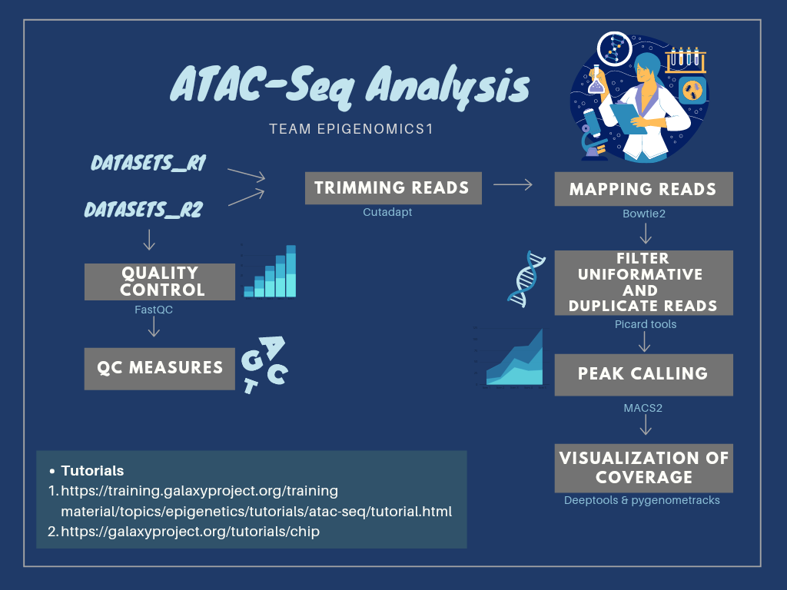
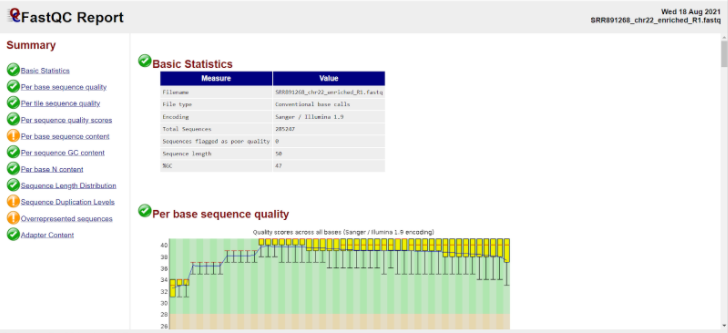

# <p align="center">🤩 HackBio2021-Team Epigenomics1 🤩
 
   <br>
  Image source: HackBio (LinkedIn) 
  
  <p align="center">  
  
 This is ***Team EPIGENOMICS1 *** for Hackbio 2021 virtual internship.
 
- 🌱 About: Hackbio Internship is a 5-weeks virtual research internship that is practice oriented and focused on equipping scientists globally with advanced bioinformatics and      computational biology skills. 
- :desktop_computer: Hackbio official website: https://thehackbio.com/
- 📫 Contact: contact@hackbio.com
- :man_technologist: We are a diverse team of awesome 17 members 👩‍💻.
<!---

--->

<br>  
   
##  :scroll: STAGE-2-PROBE :scroll:
## <p align="center"> THE TASK WE NEED TO DO IN THIS STAGE

👉 SEARCHING FOR DESIRED TUTORIALS OF BIOSTACK EPIGENOMICS.<br>
👉 HAVING A WONDERFUL WORKFLOW DESIGN.<br>
👉 REPRODUCING THE ANALYSIS.<br>
👉 CREATING A COMPREHENSIVE MARKDOWN OF THE ANALYSIS.<br>

##  <p align="center"> **WE CHOOSE ATAC-Seq Analysis**
 
 ### **What ATAC-Seq is**

ATAC-Seq, acronym of Assay for Transposase-Accessible Chromatin using Sequencing, is a technique for assessing chromatin accessibility and how it affects gene expression. The chromatin consists of several nucleosome units. A nucleosome is a complex of DNA and histone proteins that keeps DNA compact through packaging. For transcription to occur, DNA must be loosened from the nucleosomes to make it accessible to transcription factors. This accessibility of DNA mediated by chromatin is a key component of epigenetics.

In this project, we are reproducing the ATAC-Seq analysis [tutorial](https://training.galaxyproject.org/training-material/topics/epigenetics/tutorials/atac-seq/tutorial.html#trimming-reads) from the Galaxy Project. We've reproduced it completely with Linux Command Line tools too.

#### What Our Analysis is About?
 - Using ATAC-Seq analysis, here we will compare the predicted open chromatin regions to the known binding sites of CTCF (a DNA-binding protein implicated in 3D structure). CTCF is known to bind to thousands of sites in the genome and thus it can be used as a positive control for assessing if the ATAC-Seq experiment is good quality.

#### About Dataset
 - The dataset we will use here is a subset of the data used in the study of Buenrostro et al. 2013. The data from the original dataset is downsized to 200,000 randomly selected reads and about 200,000 reads pairs that will map to chromosome 22. We are only focusing on chromosome 22 so that we can handle the analysis in less time. Binding sites of CTCF identified by ChIP in the same cell line from ENCODE (ENCSR000AKB, dataset ENCFF933NTR) will also be used.

 
 
 ## :raised_hands: **WORKFLOW** :raised_hands:
 
 
### <p align="center"> GRAPHICAL WORKFLOW DESIGN
 
 <p align="center"> 
 
 
### STEP 1 :- PREPROCESSING 
  
  #### A) DATASET 
  
***<details><summary>Data Upload for galaxy</summary><br>***
  
***Create a new history***
  
1. Add or import DATASETS (2 fastq.gz files and 1 bed.gz file) for analysis via [LINK](https://zenodo.org/record/3862793#.YRze2XUvNH4) 
  
2. Add tags to R1 and R2 files. To add tags:
    - Click on the dataset
    - Click on the tag icon
    - Add a tag starting with **#: FOR  #SRR891268\_R1** FILE to the R1 file and  FOR **#SRR891268\_R2** FILE to the R2 file.
    - Check that tag appears below the dataset name

***Check datatype of files and edit if necessary***

1. Click on the pencil icon for the dataset to edit its attributes
2. In the central panel, click on the Datatypes tab on the top
3. Select correct datatype (fastqsanger.gz for the FASTQ files, and encodepeak for the bed.gz file)
4. Click the Change datatype button
 </details> 
  
  ***<details><summary> Get Data for LINUX </summary><br>***
````python
  wget https://zenodo.org/record/3862793/files/ENCFF933NTR.bed.gz
  ````
````python
  wget https://zenodo.org/record/3862793/files/SRR891268_chr22_enriched_R1.fastq.gz
  ````
````python
  wget https://zenodo.org/record/3862793/files/SRR891268_chr22_enriched_R2.fastq.gz
  ````
 ***You can unzip the sequence files with gunzip***

```python
   gunzip SRR891268_chr22_enriched_R1.fastq.gz 
  ```
```python
  gunzip SRR891268_chr22_enriched_R2.fastq.gz
  ``` 
 </details> 
  
#### B) Obtain Annotation for hg38 genes
 <details>
 <summary>Galaxy Implementation</summary>
 
1. Select the **USCS Main table browser tool** with the following parameters

- <b>clade</b>:<h style="color:blue;">Mammal</h>
- <b>genome</b>:<h style="color:blue;">Human</h>
- <b>assembly</b>:<h style="color:blue;">Dec. 2013(GRCh38/hg38)</h>
- <b>group</b>:<h style="color:blue;">Genes and Gene Prediction</h>
- <b>track</b>:<h style="color:blue;">All GENCODE V37</h>
- <b>table</b>:<h style="color:blue;">Basic</h>
- <b>region</b>:<h style="color:blue;">position chr22</h>
- <b>output format</b>:<h style="color:blue;">all fields from selected table</h>
- <b>Send output to</b>:<h style="color:blue;">Galaxy</h>

2. Click get output 

3. Click Send Query to Galaxy

4. Select the **Cut columns from a table tool** with the following parameters

1. <b>Cut columns</b>: <h style="color:blue;">c3,c5,c6,c13,c12,c4</h>
2. <b>Delimited by</b>: <h style="color:blue;">Tab</h>
3. <b>param-file From</b>: <h style="color:blue;">UCSC Main on Human: wgEncodeGencodeBasicV37 (chr22:1-50,818,468)</h>
_Rename the dataset as chr22 genes_

1. Click on the pencil icon for the dataset to edit its attributes
2. In the central panel, change the name field
3. Click the Save button

_Change the datatype to a BED format_

1. Click on the pencil icon for the dataset to edit its attributes
2. In the central panel, click on the Datatypes tab on the top
3. Select  **bed**
4. Click the Change datatype button

Click on the eye icon to check changes effected. There should be matching column names in each column of the dataset.
  </details>
 
  <details><summary>LINUX Implementation</summary>
   Go to [http://genome.ucsc.edu/cgi-bin/hgTables](http://genome.ucsc.edu/cgi-bin/hgTables) and set the parameters as-

  - <b>clade</b>:<h style="color:blue;">Mammal</h>
  - <b>genome</b>:<h style="color:blue;">Human</h>
  - <b>assembly</b>:<h style="color:blue;">Dec. 2013(GRCh38/hg38)</h>
  - <b>group</b>:<h style="color:blue;">Genes and Gene Prediction</h>
  - <b>track</b>:<h style="color:blue;">All GENCODE V37</h>
  - <b>table</b>:<h style="color:blue;">Basic</h>
  - <b>region</b>:<h style="color:blue;">position chr22</h>
  - <b>output format</h>:<h style="color:blue;">all fields from selected table</h>
  - <b>output filename</h>:<h style="color:blue;">chr22</h>
  - <b>file type returned</h>:<h style="color:blue;">gzipped compressed</h>

And then select **Get output**

Thus, chr22.gz file will be downloaded.

- <b>Converting chr22 file into a bed file:</b> 
   
1. Unzip the downloaded chr22.gz using command

   ```python
   unzip chr22.gz 
 ```
awk -F \tOFS=\t {print $3, $5, $6, $13, $12, $4 \ (chr22.bed)} chr22 
 ```
(to get only expected columns into a newly created chr22.bed file)
   
  </details>
   
#### C) QUALITY CONTROL
 
 <details>
<summary>Galaxy Implementation</summary>
<br>
Select the ***_FastQC tool_*** with the following parameters
   - 1. &quot;Short read data from your current history&quot;: Choose here either only the SRR891268_R1 file with param-file or use param-files; use Multiple datasets to choose both SRR891268_R1 and SRR891268\_R2.<br>
  - 2. Inspect the web page output of FastQC tool for the SRR891268\_R1 sample. Check what adapters are found at the end of the reads.
</details>  
 
 <details >
<summary>Linux Implementation</summary>
<br>

- Download the FastQC module
Note: FASTQC requires java and javac installed for implementation and you need to run the fastqc file from the folder (using the relative/absolute links to the sequence reads)<bR> 
```python
  sudo apt install default-jre
  ```
```python
  sudo apt install default-jdk
  ```
  Make the “fastqc” an executable file<bR>
```python 
  chmod 755 fastqc
  ```
- Run the fastqc on all sequenced reads from its folder<bR> 
```python 
  fastqc SRR891268_chr22_enriched_R1.fastq SRR891268_chr22_enriched_R2.fastq 
  ```
  
   </details>
The report for each file is generated as an html file and a zip file containing more files that can be customised for reports. Look into the html files.
  
<p align="center"> 
  
 
  
 #### TRIMMING READ
<details>
<summary>Galaxy Implementation</summary>
<br>

 - Select the **Cutadapt tool** with the following parameters

1. &quot;Single-end or Paired-end reads?&quot;: Paired-end

2. param-file &quot;FASTQ/A file #1&quot;: select SRR891268\_R1
3. param-file &quot;FASTQ/A file #2&quot;: select SRR891268\_R2
4. In &quot;Read 1 Options&quot;:

In &quot;3&#39; (End) Adapters&quot;:

param-repeat &quot;Insert 3&#39; (End) Adapters&quot;

&quot;Source&quot;: Enter custom sequence

&quot;Enter custom 3&#39; adapter name (Optional if Multiple output is &#39;No&#39;)&quot;: Nextera R1

&quot;Enter custom 3&#39; adapter sequence&quot;: CTGTCTCTTATACACATCTCCGAGCCCACGAGAC

1. In &quot;Read 2 Options&quot;:

In &quot;3&#39; (End) Adapters&quot;:

param-repeat &quot;Insert 3&#39; (End) Adapters&quot;

&quot;Source&quot;: Enter custom sequence

&quot;Enter custom 3&#39; adapter name (Optional)&quot;: Nextera R2

&quot;Enter custom 3&#39; adapter sequence&quot;: CTGTCTCTTATACACATCTGACGCTGCCGACGA

1. In &quot;Filter Options&quot;:

&quot;Minimum length&quot;: 20

1. In &quot;Read Modification Options&quot;:

&quot;Quality cutoff&quot;: 20

1. In &quot;Output Options&quot;:

&quot;Report&quot;: Yes

1. Click on the galaxy-eye (eye) icon of the report and read the first lines.
  - Check Adapter Removal

Select the **Fast QC tool** with the following parameters

1. &quot;Short read data from your current history&quot;: select the output of Cutadapt param files; use; Multiple datasets to choose both Read 1 Output and Read 2 Output.
2. Click on the galaxy-eye (eye) icon of the report and read the first lines.
  </details>
 
<details >
<summary>Linux Implementation</summary>
<br> 
 
- ##### Adapter Trimming 

The fastqc report indicates the presence of an overrepresented sequence and fastqc identifies it as &quot;Nextera Transposase Sequence &#39;&#39;. This sequence is similar to but longer than the one given in the tutorial.

```SRR891268\_chr22\_enriched\_R1 = CTGTCTCTTATACACATCTCCGAGCCCACGAGACTAAGGCGAATCTCGTA (fastqc)``` <br>

```SRR891268\_chr22\_enriched\_R1 = CTGTCTCTTATACACATCTCCGAGCCCACGAGAC (Galaxy tutorial)```<br>

```SRR891268\_chr22\_enriched\_R2 = CTGTCTCTTATACACATCTGACGCTGCCGACGAGTGTAGATCTCGGTGGT (fastqc)```<br>


```SRR891268\_chr22\_enriched\_R2 = CTGTCTCTTATACACATCTGACGCTGCCGACGA (Galaxy tutorial)```<br>


 - ##### Adapter Trimming with Cutadapt 

Install cutadapt running-

```python
$ sudo apt install cutadapt
```

For paired end trimming-
 
 ```python
 $ cutadapt -a CTGTCTCTTATACACATCTCCGAGCCCACGAGAC -A CTGTCTCTTATACACATCTGACGCTGCCGACGA --minimum-length 20 -q 20 -o trimmed\_1.fastq -p trimmed\_2.fastq SRR891268\_chr22\_enriched\_R1.fastq SRR891268\_chr22\_enriched\_R2.fastq
 ```


<figcaption align = "left"><b>Output of the Adaptor Trimming</b></figcaption> <br> 
 
 </details>
 
  <p align="center"> 


### STEP2 :- MAPPING 
  
<details>
<summary>Galaxy Implementation</summary>
<br>
 
 ### **Mapping reads to reference genome**

 - Select the **Bowtie2**   **tool** with the following parameters:

1. &quot;Is this single or paired library&quot;: Paired-end
2. param-file &quot;FASTQ/A file #1&quot;: select the output of Cutadapt tool &quot;Read 1 Output&quot;
3. param-file &quot;FASTQ/A file #2&quot;: select the output of Cutadapt tool &quot;Read 2 Output&quot;
4. &quot;Do you want to set paired-end options?&quot;: Yes

   - &quot;Set the maximum fragment length for valid paired-end alignments&quot;: 1000
&quot;Allow mate dovetailing&quot;: Yes

1. &quot;Will you select a reference genome from your history or use a built-in index?&quot;: Use a built-in genome index
2. &quot;Select reference genome&quot;: Human (Homo sapiens): hg38 Canonical
3. &quot;Set read groups information?&quot;: Do not set
4. &quot;Select analysis mode&quot;: 1: Default setting only

   - &quot;Do you want to use presets?&quot;: Very sensitive end-to-end (--very-sensitive)

1. &quot;Do you want to tweak SAM/BAM Options?&quot;: No
2. &quot;Save the bowtie2 mapping statistics to the history&quot;: Yes
3.Click on the galaxy-eye (eye) icon of the mapping stats.
  </details>

<details >
<summary>Linux Implementation</summary>
<br>
 
- Mapping and Alignment 

  Pulling the sequence for chromosome 22 for indexing and mapping <br>
 
 ```python
 $ wget --timestamping ;ftp://hgdownload.cse.ucsc.edu/goldenPath/hg38/chromosomes/chr22.fa.gz; -O chr22.fa.gz
 ```

- For mapping to chr22-

1. Install bowtie2 <bR> 
```python
 bowtie2-build chr22.fa.gz indexed\_chr22
 ```
2. Create index for Chromosome 22: <bR> 
```python
 bowtie2-build chr22.fa.gz indexed_chr22
 ```
3. Start mapping for the parameters specified by Galaxy: <bR> 

 ```python
 bowtie2 --very-sensitive --maxins 1000 --dovetail -x indexed\_chr22 -1 trimmed\_1.fastq -2 trimmed\_2.fastq -S Aligned\_output.sam
 ```

 <p align="center"> 

</details>    
  
### STEP 3 :- Filtering Mapped Reads 
  
#### A) Filter Uninformative Reads
  
 <details>
<summary>Galaxy Implementation</summary>
<br>
   
 ****_Filtering of uninformative mapped reads_****

Select the **Filter BAM datasets on a variety of attributes**   **tool** with the following parameters

param-file &quot;BAM dataset(s) to filter&quot;: Select the output of Bowtie2 tool &quot;alignments&quot;

In &quot;Condition&quot;:

1. param-repeat &quot;Insert Condition&quot;
2. In &quot;Filter&quot;:
3. param-repeat &quot;Insert Filter&quot;

&quot;Select BAM property to filter on&quot;: mapQuality

&quot;Filter on read mapping quality (phred scale)&quot;: \&gt;=30

1. param-repeat &quot;Insert Filter&quot;

&quot;Select BAM property to filter on&quot;: isProperPair

&quot;Select properly paired reads&quot;: Yes

1. param-repeat &quot;Insert Filter&quot;

&quot;Select BAM property to filter on&quot;: reference

&quot;Filter on the reference name for the read&quot;: !chrM

&quot;Would you like to set rules?&quot;: No

Click on the input and the output BAM files of the filtering step. Check the size of the files.
 
 </details >
  
<details >
<summary>Linux Implementation</summary>
<br>
 
****_Filtering of uninformative mapped reads_****

1. Install samtools.
```python
 samtools view -q 30 -f 0x2 -b -h Aligned\_output.sam \; Filtered\_output.bam
 ```

we will filter out uninformative reads (Mapping quality \&gt;= 30 &amp; Properly Paired)

 </details> 
  
#### B) Filter duplicate reads
  
  <details>
<summary>Galaxy Implementation</summary>
<br>
   
***_Remove duplicates_***

Select the **MarkDuplicates**   **tool** with the following parameters

1. param-file &quot;Select SAM/BAM dataset or dataset collection&quot;: Select the output of Filter tool &quot;BAM&quot;
2. &quot;If true do not write duplicates to the output file instead of writing them with appropriate flags set&quot;: Yes

Click on the eye icon of the MarkDuplicate metrics.
  
  </details>
  
 <details >
<summary>Linux Implementation</summary>
<br>
  
 **_Mark Duplicate Reads_**

- Download picard.jar in your working folder from [here](https://github.com/broadinstitute/picard/releases/download/2.26.0/picard.jar) <br>
- From that directory, run <br> ````python
  java -jar picard.jar -h
  ````
  to check whether it works (you can skip this step) <br>
- For sorting the output file from last step use- <br>
  ```python
  samtools sort -T temp -O bam -o filtered\_output\_sorted.bam Filtered\_output.bam
  ```
- Finally, run <br>
  ```pythonjava -jar picard.jar MarkDuplicates I=filtered\_output\_sorted.bam O=marked\_dup.bam M=marked\_dup.metrics.txt
  ``` 
  <br>for marking duplicates
- If you can have a look into the metrics in the metrics.txt file
  
    </details>
  
  #### C) Check Insert Sizes 
 
   - Check Insert Size tells us the size of the DNA fragment the read pairs came from this step we have to make a plot of the frequencies of the reads in the bam file to observe the peaks around where there are likely Tn5 transposase activities into nucleosome-free regions.<br>

  
  <details>
<summary>Galaxy Implementation</summary>
<br>
   
****_Plot the distribution of fragment sizes_****

Select **Paired-end histogram tool** with the following parameters

1. param-file &quot;BAM file&quot;: Select the output of MarkDuplicates tool &quot;BAM output&quot;
2. &quot;Lower bp limit (optional)&quot;: 0
3. &quot;Upper bp limit (optional)&quot;: 1000

Click on the galaxy-eye (eye) icon of the lower one of the 2 outputs (the png file).

</details>
 
  <details >
<summary>Linux Implementation</summary>
<br>

```python
   sudo apt install r-base
   ```
```python
   java -jar picard.jar CollectInsertSizeMetrics I=marked\_dup.bam O=chart.txt H=insertSizePlot.pdf M=0.5
   ```
   
   </details>
 


<p align="center">  

Two peaks can be observed around the 200bp and 400bp from the plot

  
                                                                                                                                                    
 ### STEP 4 :- PEAK CALLING
- Peak calling helps us to identify regions where reads have piled up (peaks) greater than the background read coverage. Using MACS2 we will extend the start sites of the reads by 200bp (100bp in each direction) to assess coverage. Before using MACS2, we need to convert the output BAM file from MarkDuplicate stage to BED format because when we set the extension size in MACS2, it will only consider one read of the pair while here, we would like to use the information from both.
                                                                                                                                                   
<details>
<summary>Galaxy Implementation</summary>
<br>  
                                                                                                                                                      
 ***_Convert BAM to BED_***

Convert BAM file (output of MarkDuplicates) into BED format by **bedtools BAM to BED converter**.
                                                                                                                                                      
#### A) MACS2 callpeak  **MACS2 callpeak**

**MACS2 callpeak** with the following parameters:

- Are you pooling Treatment Files?: No
  - Select the output of  **bedtools BAM to BED**  converter tool
- Do you have a Control File?: No
- Format of Input Files: Single-end BED
- Effective genome size: _H. sapiens_ (2.7e9)
- Build Model: Do not build the shifting model (--nomodel)
  - Set extension size: 200
  - Set shift size: -100. It needs to be - half the extension size to be centered on the 5&#39;.
- In Additional Outputs:
  - Check Peaks as tabular file (compatible with MultiQC)
  - Check Peak summits
  - Check Scores in bedGraph files
- In  Advanced Options:
  - Composite broad regions: No broad regions
    - Use a more sophisticated signal processing approach to find subpeak summits in each enriched peak region: Yes
  - How many duplicate tags at the exact same location are allowed?: all                                                                                                         </details>                                        
<details>
<summary> LINUX Implementation</summary>
<br> 
                                                                                                                                                      
Install bamtools and convert bam file to bed file using bamtools:  
 ```python
 bedtools bamtobed -i marked\_dup.bam \marked\_dup.bed
 ```` 
Install macs2 :
 ```python
 conda install -c bioconda macs2
 ````
Then run the command for peak calling: 

 ```python
 macs2 callpeak -t marked\_dup.bed -n macs\_output -g 50818468 --nomodel --shift -100 --extsize 200 --keep-dup all --call-summits --bdg
 ```

***This will give us the following 5 output files-***

- Macs\_output\_control\_lambda.bdg 

- macs\_output\_peaks.narrowPeak    
 
- Macs\_output\_peaks.xls          

- Mac_output_summits.bed           
 
- macs_output_treat_pileup.bdg     
 
  </details>                                                                                                                                                           
   
### STEP 5 :-Visualisation of Coverage 

#### A) Prepare the Datasets
                                                                                                                                                      
  1. **Extract CTCF peaks on chr22 in intergenic regions**
 - As our training dataset is focused on chromosome 22 we will only use the CTCF peaks from chr22. We expect to have ATAC-seq coverage at TSS but only good ATAC-seq have coverage on intergenic CTCF. Indeed, the CTCF protein is able to position nucleosomes and creates a region depleted of nucleosome of around 120bp. This is smaller than the 200bp nucleosome-free region around TSS and also probably not present in all cells. Thus it is more difficult to get enrichment.                                                                                                                                                    
<details>
<summary>Galaxy Implementation</summary>
<br>     
                                                                                                                                                      
In order to get the list of intergenic CTCF peaks of chr22, select the peaks on chr22 and then exclude the one which overlap with genes.

- **Filter data on any column using simple expressions**   with the following parameters:
  - Filter : Select the first dataset: ENCFF933NTR.bed.gz
  - With following condition: c1==&#39;chr22&#39;
- **bedtools Intersect intervals find overlapping intervals in various ways** with the following parameters:
  - File A to intersect with B: Select the output of  **Filter**  data on any column using simple expressions tool
  - Combined or separate output files: One output file per &#39;input B&#39; file
    - File B to intersect with A: Select the dataset chr22 genes
  - What should be written to the output file?: Write the original entry in A for each overlap (-wa)
  - Required overlap: Default: 1bp
  - Report only those alignments that  **do not**  overlap with file(s) B: Yes
- Rename the datasets intergenic CTCF peaks chr22.
                                                                                                                                                     
</details> 
                                                                                                                                                      
<details>
<summary>LINUX Implementation</summary>
<br>                                                                                                                                                                 
1. Filter only data for chr22 from file using 
 
 ````python
 grep -w chr22; ENCFF933NTR.bed \ file\_A.bed
 ````
 
 ````python
 Extract filtered chrr22 (as c1) into a new file- $ grep c1 ENCFF933NTR\_filt.bed \ENCFF933NTR\_chr22.bed
 ````
 
 ````python
 Replace c1 with chr22- sed s/c1/chr22/ ENCFF933NTR\_chr22.bed ; ENCFF933NTR\_CHR22genes.bed
 ````
4. bedtools Intersect intervals find overlapping intervals : 
 
 ````python
 bedtools intersect -v -a ENCFF933NTR\_CHR22genes.bed -b chr22\_genes.bed \intergenic\_CTCF\_peaks\_chr22
 ````
                                                                                                                                                     
 </details> 
                                                                                                                                                      
#### B)Convert bedgraph from MACS2 to bigwig
- To visualise any region of the genome very quickly, we need to change the bedgraph format from MACS2 output to binary bigwig format.
                                                                                                                                                      
<details>
<summary>Galaxy Implementation</summary>
<br>                                     
<strong>Wig/BedGraph-to-bigWig</strong> with the following parameters:

  - Convert: Select the output of  **MACS2**  tool (Bedgraph Treatment).
  - Converter settings to use: Default
- Rename the datasets MACS2 bigwig.
</details>
                                                                                                                                                      
<details>
<summary>LINUX Implementation</summary>
<br>        
 Install <strong>bedGraphtoBigWig</strong> and go through the following commands for converting the output bedGraph file from macs2 to bigwig (refer to this link if you want to understand the commands [https://www.biostars.org/p/176875/](https://www.biostars.org/p/176875/) )

````python
 awk NR!=1 macs\_output\_treat\_pileup.bdg \ macs.deheader.bedGraph
 ```` 

````python
 sort -k1,1 -k2,2n macs.deheader.bedGraph \ macs.sorted.bedGraph 
 ````

````python
 touch chrom22.sizes
 ````
 
````python
 nano hg19.chrom.sizes
 ````
 → write only one line (tab delimited) in this file chr22 51304566 
 
````python
 awk {print $1,$2,$3,$4} macs.sorted.bedGraph \ macs.sorted.4.bedGraph
 ````
 
````python
 bedGraphToBigWig macs.sorted.4.bedGraph hg19.chrom.sizes macs.bw 
 ````
 
 </details>                                                                                                                                                    

 #### C) Create heatmap of coverage at TSS with deepTool
 
- For checking the coverage on specific regions, we can compute heatmap. ComputeMatrix &amp; plotHeatmap from deepTools are useful for this purpose. We will here make a heatmap centered on the transcription start sites (TSS) and another one centered on intergenic CTCF peaks.

<details>
<summary>Galaxy Implementation</summary>
<br>                                                                                                                                                               
- <strong>computeMatrix</strong> with the following parameters:
  - In  Select regions:
    - Insert Select regions
      - Regions to plot: Select the dataset chr22 genes
  - Sample order matters: No
    - Score file: Select the output of  **Wig/BedGraph-to-bigWig**  tool that should be named MACS2 bigwig.
  - computeMatrix has two main output options: reference-point
  - The reference point for the plotting: beginning of region (e.g. TSS)
  - Show advanced output settings: no
  - Show advanced options: yes
  - Convert missing values to 0?: Yes
  1. **Plot with plotHeatmap**

- **plotHeatmap**   with the following parameters:
  - Matrix file from the computeMatrix tool: Select the output of  **computeMatrix**  tool.
  - Show advanced output settings: no
  - Show advanced options: no
                                                     
<p align="center">  
 <p align="center"> **** Figure: plotHeatmap output *****

                                     
The same is repeated for the intergenic CTCF peaks.

**Generate the matrix**

- **computeMatrix** with the following parameters:
  - In Select regions:
    - Insert Select regions
      - Regions to plot: Select the dataset intergenic CTCF peaks chr22
  - Sample order matters: No
    - Score file: Select the output of  **Wig/BedGraph-to-bigWig**  tool that should be named MACS2 bigwig.
  - Would you like custom sample labels?: No, use sample names in the history
  - computeMatrix has two main output options: reference-point
    - The reference point for the plotting: center of region
  - Show advanced output settings: no
  - Show advanced options: yes
    - Convert missing values to 0?: Yes

 - **plotHeatmap**   with the following parameters:
  - Matrix file from the computeMatrix tool: Select the output of  **computeMatrix**  tool.
  - Show advanced output settings: no
  - Show advanced options: yes
    - In Colormap to use for each sample:
      - Insert Colormap to use for each sample
        1. Color map to use for the heatmap: your choice
    - The x-axis label: distance from peak center (bp)
    - The y-axis label for the top panel: CTCF peaks
    - Reference point label: peak center
    - Labels for the regions plotted in the heatmap: CTCF\_peaks
    - Did you compute the matrix with more than one groups of regions?: Yes, I used multiple groups of regions

                                                     
   <p align="center"> 
     <p align="center"> Figure: plotHeatmap output on CTCF
 </details>   
                      
<details>
<summary>LINUX Implementation</summary>
<br>                                                                                                                                                    
- Using <strong>computeMatrix</strong> generate the matrix

1. Remove the first header line from chr22.bed file
2. Then run
 
 ```python
 computeMatrix reference-point --referencePoint TSS -R chr22.bed -S macs.bw --missingDataAsZero -o output\_from\_computeMatrix.gz
 ``` 
 
- plotHeatmap will generate the plot using the output of computeMatrix 

 
````python
 plotHeatmap -m output\_from\_computeMatrix.gz -out plotHeatMap.png
 ````

- Repeating the previous two steps for plotting **CTCF peaks of chr22 in intergenic regions** with slight moderation: 

 
````python
 computeMatrix reference-point --referencePoint center -R intergenic\_ctcf\_peaks\_chr22 -S macs.bw --missingDataAsZero -o peak\_output\_from\_computeMatrix.gz
 ```` 

````python
 plotHeatmap -m peak\_output\_from\_computeMatrix.gz -out intragenic\_plotHeatMap.png
 ````

In the generated heatmaps, each line will be a transcript. The coverage will be summarized with a color code from red (no coverage) to blue (maximum coverage). All TSS will be aligned in the middle of the figure and only the 2 kb around the TSS will be displayed. Another plot, on top of the heatmap, will show the mean signal at the TSS. There will be one heatmap per bigwig.

For TSS, our data gives the following heatmap-

 <p align="center">  

The plot on top shows a non-symmetric pattern that is higher on the left, which is expected as usually the promoter of active genes is accessible.

For CTCF peaks of chr22 in intergenic regions, the following heatmap is generated from our data-

<p align="center">  
                                                        
This heatmap is showing a much more symmetric pattern.

</details>  
 
#### D)Visualise Regions with pyGenomeTracks
 
  - In order to visualise a specific region (e.g. the gene _RAC2_), we will use pyGenomeTracks 
 
<details>
<summary>Galaxy Implementation</summary>
<br>       
 
  - **pyGenomeTracks**  Tool with the following parameters:
  - Region of the genome to limit the operation: chr22:37,193,000-37,252,000
  - In Include tracks in your plot:
    - Insert Include tracks in your plot
      - Choose style of the track: Bigwig track
        1. Plot title: Coverage from MACS2 (extended +/-100bp)
        2. Track file(s) bigwig format: Select the output of Wig/BedGraph-to-bigWig tool called MACS2 bigwig.
        3. Color of track: Select the color of your choice
        4. Minimum value: 0
        5. height: 5
        6. Show visualization of data range: Yes
    - Insert Include tracks in your plot
      - Choose style of the track: NarrowPeak track
        1. Plot title: Peaks from MACS2 (extended +/-100bp)
        2. Track file(s) encodepeak or bed format: Select the output of MACS2 tool (narrow Peaks).
        3. Color of track: Select the color of your choice
        4. display to use: box: Draw a box
        5. Plot labels (name, p-val, q-val): No
    - Insert Include tracks in your plot
      - Choose style of the track: Gene track / Bed track
        1. Plot title: Genes
        2. Track file(s) bed or gtf format: chr22 genes
        3. Color of track: Select the color of your choice
        4. height: 5
        5. Plot labels: yes
          1. Put all labels inside the plotted region: Yes
          2. Allow to put labels in the right margin: Yes
    - Insert Include tracks in your plot
      - Choose style of the track: NarrowPeak track
        1. Plot title: CTCF peaks
        2. Track file(s) encodepeak or bed format: Select the first dataset: ENCFF933NTR.bed.gz
        3. Color of track: Select the color of your choice
        4. display to use: box: Draw a box
        5. Plot labels (name, p-val, q-val): No
    - param-repeat Insert Include tracks in your plot
      - Choose style of the track: X-axis
                                                             
 <p align="center">  
</details>
  
 <details>
<summary>Linux Implementation</summary>
<br>                                     
<p><strong>Set up the config.ini file with the following contents-</p></strong>

<i>**[test bedgraph]**</i>

<i>**file = macs.bw** </i>

<i> **color = blue**</i>

<i>**height = 5** </i>
<i>**title = Coverage from MACS2 (extended +/-100bp)**</i>

<i> **min\_value = 0**</i>

<i>**[spacer]**</i>

<i>**height = 0.5**</i>

<i>**[narrow]**</i>

<i>**file = intergenic\_ctcf\_peaks\_chr22.encodepeak**</i>

<i>**line\_width = 2**</i>

<i>**title = Peaks from MACS2 (extended +/-100bp)**</i>

<i>**type = box**</i>

<i>**color = red** </i>

<i>**show\_labels = false**</i>

<i>**file\_type = narrow\_peak**</i>

<i>**[spacer]**</i>
<i>**height = 0.5** </i>

<i>**[genes 0]**</i>

<i>**file = chr22.bed**</i>

<i>**height = 7** </i>

<i>**title = genes**</i>

<i>**height = 5** </i>

<i>**color = #ffbbff** </i>
<i>**[spacer]**</i>

<i>**height = 0.5**</i>

<i>**[narrow 1]**</i>

<i>**file = ENCFF933NTR\_sorted.bed** </i>

<i>**color = #A020F0** </i>

<i>**line\_width = 2**</i>

<i>**title = CTCF peaks** </i>

<i>**type = box** </i>

<i>**show\_labels = false**</i>

<i>**[x-axis]**</i>

- Sort ENCFF933NTR.bed file-

````python
 sort -k 1,1 -k2,2n ENCFF933NTR.bed ; ENCFF933NTR\_sorted.bed
 ````

- Install pyGenomeTracks using <br>
 
 ```python
 conda -install -c bioconda pyGenomeTracks
 ```
 
- Visualize regions by running- <br>
 
 ```python
 pyGenomeTracks --tracks config.ini --region chr22:37,193,000-37,252,000 -o Genome\_track\_plot.png
 ```
 
 </details>

<p align="center"> 
 
 </details>
 
- From the figure, we can see 3 accessible TSS for 6 transcripts for 2 genes. The TSS of RAC2 corresponds to an ATAC-Seq peak whereas there is no significant coverage on both TSS of SSTR3. Again, it can be said that only the first peak on the left overlaps with a CTCF binding site represents accessible loci. Amongst the 4 peaks in this plotted region, the 2 peaks in the middle do not correspond to CTCF peaks or TSS. As CTCF creates accessible regions, a region containing a peak with no corresponding CTCF peak or TSS could be a putative enhancer. In the pyGenomeTracks plot we see a region like this located in the intron of a gene and another one between genes. More analyses are needed to assess if it is a real enhancer, for example, histone ChIP-seq, 3D structure, transgenic assay, etc. 
                                                                               
As CTCF creates accessible regions, a region containing a peak with no corresponding CTCF peak or TSS could be a putative enhancer. In the pyGenomeTracks plot we see a region like this located in the intron of a gene and another one between genes.

## Conclusion

ATAC-Seq is a method to investigate the chromatin accessibility and the genome is treated with a transposase (enzyme) called Tn5. It marks open chromatin regions by cutting and inserting adapters for sequencing. Low quality bases, adapter contamination, correct insert size and PCR duplicates (duplication level) were checked. Mapped the reads with  **Bowtie2** , filtered the reads for properly paired, good quality and reads that do not map to the mitochondrial genome. Open chromatin regions were found with  **MACS2** , a tool to find regions of genomic enrichment (peaks). The read coverage around TSS was investigated with the help of  **computeMatrix**  and  **plotHeatmap**. The peaks and other informative tracks, such as CTCF binding regions and hg38 genes were visualised with the help of  **pyGenomeTracks**. At the end, open chromatin regions that did not overlap with CTCF sites or TSS, which could be potential putative enhancer regions detected by the ATAC-Seq experiment.


## REFERENCES

1. Lucille Delisle, Maria Doyle, Florian Heyl, 2021 **ATAC-Seq data analysis (Galaxy Training Materials)**. [https://training.galaxyproject.org/training-material/topics/epigenetics/tutorials/atac-seq/tutorial.html](https://training.galaxyproject.org/training-material/topics/epigenetics/tutorials/atac-seq/tutorial.html) Online; accessed Thu Aug 19 2021

 
 ## ⚙ TOOL USED  🦾
- [x] Fastqc       
- [x] Cutadapt
- [x] Bowtie2
- [x] Samtools
- [x] Picard
     - CollectInsertSizeMetrics
     - MarkDuplicates 
- [x] Bedtools
- [x] DeepTool
     - ComputeMatrix
     -  PlotHeatmap
- [x] MACS2                                                                                                                                                                         
- [x] BedGraphtoBigWig
- [x] PyGenomeTracks     
 
 ### TEAM WORK CONTRIBUTION 
| Slack username  | Suggesting workflows | Workflow Design      | Galaxy Based Implementation | Linux Based Implementation | Creating github repo & Markdown file formatting | Writing the galaxy workflow for markdown | Writing the Linux workflow for markdown | Others                                                              |
|-----------------|----------------------|----------------------|-----------------------------|----------------------------|--------------------------------------------------------------------------------------------|-----------------------------------------|---------------------------------------------------------------------|
| @Sanjana1404    | :heavy\_check\_mark: |                      | :heavy\_check\_mark:        |                            |                                                 |                                          |                                         |                                                                     |
| @Comfortojedapo | :heavy\_check\_mark: |                      | :heavy\_check\_mark:        |                            | :heavy\_check\_mark:                            |                                          |                                         | Team Lead                                                           |
| @Jaswanth       | :heavy\_check\_mark: | :heavy\_check\_mark: | :heavy\_check\_mark:        |                            | :heavy\_check\_mark:                            |                                          |                                         |                                                                     |
| @Jeeel193       | :heavy\_check\_mark: |                      | :heavy\_check\_mark:        |                            |                                                 |                                          |                                         | Creating a new workflow design for markdown file                    |
| @Sathya         | :heavy\_check\_mark: |                      | :heavy\_check\_mark:        |                            |                                                 | :heavy\_check\_mark:                     |                                         |                                                                     |
| @Malu           | :heavy\_check\_mark: | :heavy\_check\_mark: | :heavy\_check\_mark:        |                            |                                                 |                                          |                                         |                                                                     |
| @Adams          | :heavy\_check\_mark: |                      | :heavy\_check\_mark:        |                            |                                                 |                                          |                                         |                                                                     |
| @Mercyme        | :heavy\_check\_mark: |                      | :heavy\_check\_mark:        |                            | :heavy\_check\_mark:                            |                                          |                                         |                                                                     |
| @Wealth88       | :heavy\_check\_mark: |                      | :heavy\_check\_mark:        |                            |                                                 | :heavy\_check\_mark:                     |                                         |                                                                     |
| @Maryamabdul    | :heavy\_check\_mark: |                      | :heavy\_check\_mark:        |                            |                                                 |                                          |                                         |                                                                     |
| @Nishat         | :heavy\_check\_mark: |                      |                             | :heavy\_check\_mark:       |                                                 |                                          |                                         | Team Lead                                                           |
| @Akinmode       |                      |                      |                             | :heavy\_check\_mark:       |                                                 |                                          | :heavy\_check\_mark:                    | Creating the workflow design for marketing  at the transfer market  |
| @XR2            | :heavy\_check\_mark: |                      | :heavy\_check\_mark:        |                            |                                                 |                                          |                                         |                                                                     |
| @Kehinde16      |                      |                      |                             | :heavy\_check\_mark:       |                                                 |                                          | :heavy\_check\_mark:                    |                                                                     |
| @Sakshi_r_      |                      |                      | :heavy\_check\_mark:        |                            |                                                 |                                          |                                         |                                                                     |
| @Tardigrade     |                      |                      | :heavy\_check\_mark:        |                            |                                                 |                                          |                                         | Provided Result Images                                              |
 
 
                                                                                                                                                     
<p align="center"> 
 
 
 
 
 
 
 
 
 

  
 
 
 
 
 
 
 
 
 
 
 
 
 
 
 
 
 
 
 
 
 
 
 
 
 
 
 
 
 
 
 
 
 
 
 
 
 
 
 
 
 
 
 
 
 
 
 
 
 
 
 
